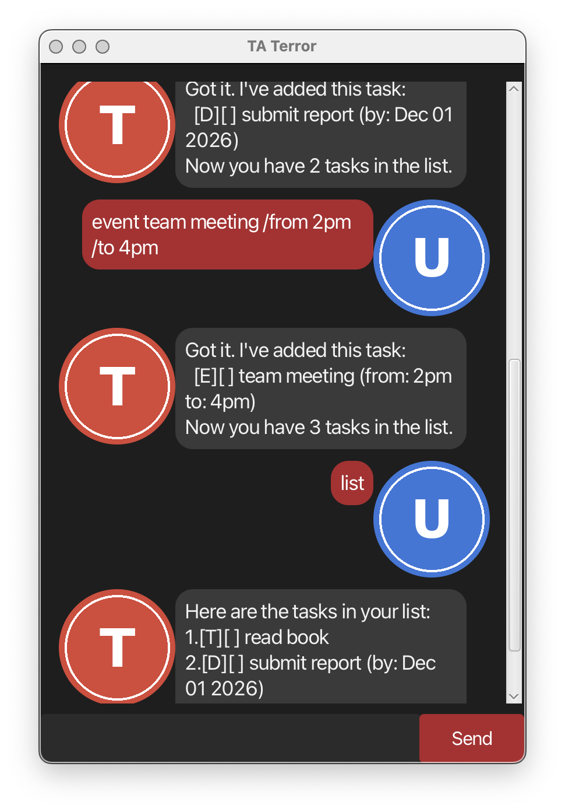

# TA Terror User Guide



TA Terror is a desktop chatbot for tracking your todos, deadlines, and events, with a text-based command interface and a clean chat-style GUI. It's fast to use once you're comfortable typing commands — and it won't hesitate to let you know when you've typed one wrong.

- [Quick start](#quick-start)
- [Adding a todo: `todo`](#adding-a-todo-todo)
- [Adding a deadline: `deadline`](#adding-a-deadline-deadline)
- [Adding an event: `event`](#adding-an-event-event)
- [Listing all tasks: `list`](#listing-all-tasks-list)
- [Finding tasks: `find`](#finding-tasks-find)
- [Marking a task as done: `mark`](#marking-a-task-as-done-mark)
- [Unmarking a task: `unmark`](#unmarking-a-task-unmark)
- [Deleting a task: `delete`](#deleting-a-task-delete)
- [Setting a task's priority: `priority`](#setting-a-tasks-priority-priority)
- [Exiting the app: `bye`](#exiting-the-app-bye)
- [Saving and loading data](#saving-and-loading-data)
- [Command summary](#command-summary)

## Quick start

1. Ensure you have Java 25 installed on your computer (Mac users: the specific Azul JDK 25 + JavaFX distribution described in the [SE-EDU Java setup guide](https://se-education.org/guides/tutorials/javaInstallationMac.html)).
2. Download the latest `taterror.jar` from the [releases page](https://github.com/shrad1601/ip/releases).
3. Copy the file into an empty folder you want to use as the home for your chatbot.
4. Open a terminal in that folder and run:
   ```
   java -jar taterror.jar
   ```
5. Type a command in the input box and press Enter or click **Send**. Some examples:
   - `list` — see all your tasks
   - `todo read book` — add a todo
   - `deadline submit report /by 2026-12-01` — add a deadline
6. Refer to the sections below for details on each command.

## Adding a todo: `todo`

Adds a simple task with a description and no attached date.

Format: `todo DESCRIPTION`

Example: `todo read book`

```
Got it. I've added this task:
  [T][ ] read book
Now you have 1 tasks in the list.
```

## Adding a deadline: `deadline`

Adds a task that needs to be done by a specific date.

Format: `deadline DESCRIPTION /by DATE`

`DATE` should be in `yyyy-MM-dd` format (e.g. `2026-12-01`) so it can be displayed nicely; any other text is still accepted and shown as-is.

Example: `deadline submit report /by 2026-12-01`

```
Got it. I've added this task:
  [D][ ] submit report (by: Dec 01 2026)
Now you have 2 tasks in the list.
```

## Adding an event: `event`

Adds a task that spans a start and end time.

Format: `event DESCRIPTION /from START /to END`

Example: `event team meeting /from 2pm /to 4pm`

```
Got it. I've added this task:
  [E][ ] team meeting (from: 2pm to: 4pm)
Now you have 3 tasks in the list.
```

💡 **Tip:** All three add commands (`todo`, `deadline`, `event`) accept an optional trailing `/priority LEVEL` flag, where `LEVEL` is one of `none`, `low`, `medium`, or `high`. Example: `todo read book /priority high`.

## Listing all tasks: `list`

Shows every task currently on your list, numbered from 1.

Format: `list`

```
Here are the tasks in your list:
1.[T][ ] read book
2.[D][ ] submit report (by: Dec 01 2026)
3.[E][ ] team meeting (from: 2pm to: 4pm)
```

## Finding tasks: `find`

Shows every task whose description contains the given keyword.

Format: `find KEYWORD`

Example: `find book`

```
Here are the matching tasks in your list:
1.[T][ ] read book
```

## Marking a task as done: `mark`

Marks the task at the given position as done.

Format: `mark INDEX`

Example: `mark 1`

```
Nice! I've marked this task as done:
  [T][X] read book
```

## Unmarking a task: `unmark`

Marks the task at the given position as not done.

Format: `unmark INDEX`

Example: `unmark 1`

## Deleting a task: `delete`

Removes the task at the given position from the list.

Format: `delete INDEX`

Example: `delete 2`

```
Noted. I've removed this task:
  [D][ ] submit report (by: Dec 01 2026)
Now you have 2 tasks in the list.
```

## Setting a task's priority: `priority`

Changes the priority of a task already on the list.

Format: `priority INDEX LEVEL`

`LEVEL` is one of `none`, `low`, `medium`, or `high`.

Example: `priority 1 high`

```
Fine, priority updated:
  [T][ ] read book (priority: HIGH)
```

## Exiting the app: `bye`

Format: `bye`

Ends the session. TA Terror will see you off with one of its own sign-offs.

## Saving and loading data

Your tasks are automatically saved to disk after every change, and reloaded automatically the next time you start TA Terror from the same folder — no manual save needed.

## Command summary

| Action | Format | Example |
|---|---|---|
| Todo | `todo DESCRIPTION` | `todo read book` |
| Deadline | `deadline DESCRIPTION /by DATE` | `deadline submit report /by 2026-12-01` |
| Event | `event DESCRIPTION /from START /to END` | `event team meeting /from 2pm /to 4pm` |
| List | `list` | `list` |
| Find | `find KEYWORD` | `find book` |
| Mark | `mark INDEX` | `mark 1` |
| Unmark | `unmark INDEX` | `unmark 1` |
| Delete | `delete INDEX` | `delete 2` |
| Priority | `priority INDEX LEVEL` | `priority 1 high` |
| Exit | `bye` | `bye` |
